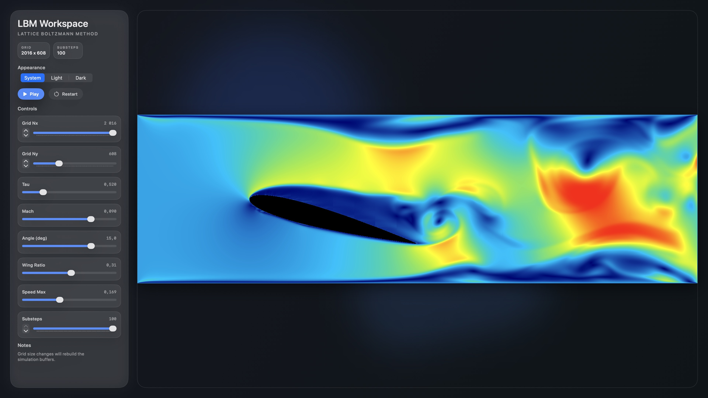

# LBM (Metal + SwiftUI)

Interactive 2D **Lattice Boltzmann Method (LBM)** flow simulation on macOS, accelerated with **Metal compute shaders** and visualized in real time with SwiftUI/MetalKit.

## Showcase



## What it does

- Runs a D2Q9 BGK LBM solver fully on the GPU.
- Builds a solid obstacle mask from a rotated NACA-style symmetric airfoil profile.
- Applies inlet/outlet and wall boundary conditions each step.
- Displays velocity magnitude with a jet-like color map (solid cells in black).
- Provides live controls for grid size, flow parameters, and simulation pacing.

## Requirements

- macOS (project deployment target: **15.4**)
- Xcode (created with Xcode 16.x toolchain)
- Apple GPU with Metal support

## Run

From the repository root (the folder containing `LBM.xcodeproj`):

```bash
open LBM.xcodeproj
```

Then select scheme `LBM` and run.

Optional CLI build:

```bash
xcodebuild -project LBM.xcodeproj -scheme LBM -configuration Debug build
```

## Simulation model

- **Lattice:** D2Q9 (`Shaders/Kernel.h`)
- **Collision:** BGK single-relaxation-time with parameter `tau`
- **Initialization:** uniform inlet-aligned velocity from Mach number
- **Per step kernels:**
1. `collide_stream` (stream + collide for interior)
2. `boundary` (walls + inlet/outlet treatment)
- **Obstacle:** `solid_mask` kernel generates an airfoil mask from:
  - `chordRatio` (airfoil chord as fraction of domain width)
  - `aoaDeg` (angle of attack)

## UI controls

Default values are set in `SwiftUI View/ContentView.swift`.

| Control | Range | Default | Effect |
|---|---:|---:|---|
| Grid Nx | 32 ... 2024 (step 32) | 2016 | Domain width; reallocates GPU buffers |
| Grid Ny | 32 ... 2024 (step 32) | 736 | Domain height; reallocates GPU buffers |
| Tau | 0.50 ... 0.60 | 0.54 | Relaxation time (viscosity control) |
| Mach | 0.001 ... 0.12 | 0.09 | Inlet speed scale |
| Angle (deg) | -30 ... 30 | 10.2 | Airfoil angle of attack |
| Wing Ratio | 0.10 ... 0.50 | 0.30 | Airfoil chord ratio |
| Speed Max | 0.02 ... 0.40 | 0.15 | Visualization normalization only |
| Substeps | 1 ... 100 | 51 | Solver iterations per rendered frame |

Transport controls:
- `Play/Pause`: toggles simulation stepping.
- `Restart`: reinitializes distributions and obstacle mask.

## Project layout

- `Shaders/`: Metal compute + render shaders (`initialize`, `solid_mask`, `collide_stream`, `boundary`, vertex/fragment)
- `Render/`: simulation pass and graphics pass orchestration
- `Control/`: renderer and camera
- `SwiftUI View/`: control panel and simulation surface UI
- `Geometry/`, `Utility/`: mesh/transform/math helpers

## Notes

- Parameter changes for `tau`, `Mach`, `aoaDeg`, and `chordRatio` trigger a simulation reset.
- Grid changes rebuild simulation buffers.
- `Speed Max` changes the color scaling only (not solver physics).
